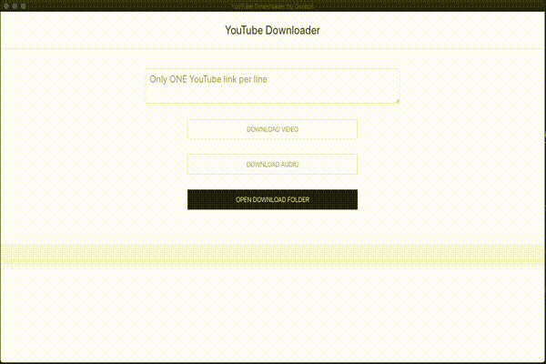

# YouTube Downloader

---

## Download

Download the [latest release for your platform](https://github.com/gpnn/youtube-downloader-electron/releases/latest).

## Demo GIF

## Motivation

This project started from my parents asking me how to download YouTube videos or music from YouTube.

The problem is that I didn't want to send my parents to a suspicious online tool filled with ads.

At first, I made them a Python commandline app to download, but that was too verbose.

Then, I had the idea to have a try at developing a clean and straightforward UI as a desktop app for them to use.

## Getting started with development

* Clone this repo
* Run `npm install` in the root directory to install dependencies
* Run `npm start` to start the development server (Electron)

### To build and package

* Run `npm run dist`

For this step, you will need have NPM and the dependencies installed.

### Prerequisites

* Node.js 12+
* [FFmpeg](https://www.ffmpeg.org/)

This project makes use of FFmpeg to convert to mp3.

## Built with / technologies

* UIkit CSS framework
* Electron.js
* Node.js

## Roadmap / Todo

* [x] Implement back-end logic for downloading
* [x] Release alpha
* [x] Add bulk download functionality
* [x] Right click to paste functionality
* [x] Button to open folder with downloaded content
* [x] Separate downloaded content from Electron files

## License

[MIT License](https://choosealicense.com/licenses/mit/#)
